# 변경 이력

## 2026-08-03

### 추가

**메모를 열면 목록의 체크 선택이 자동으로 해제됨**

| AS-IS | TO-BE |
|---|---|
| 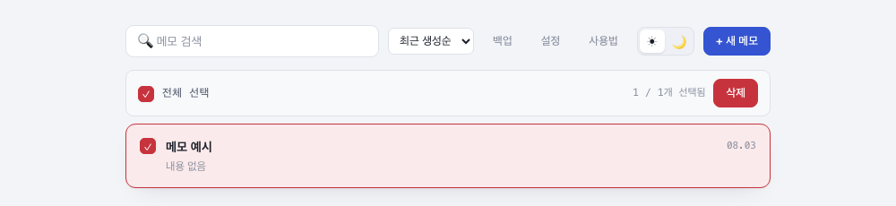 | 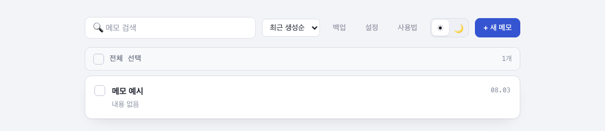 |

메모 하나를 체크한 뒤 편집하러 들어갔다가 돌아오면 체크가 그대로 남아있던 문제 → 메모를 열 때 선택 상태를 초기화.

**"/" 입력으로 날짜 삽입**

| AS-IS | TO-BE |
|---|---|
| 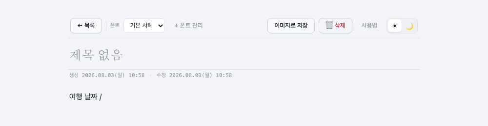 | 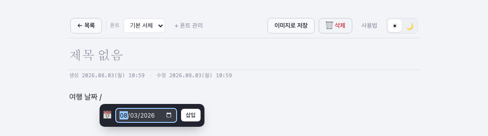 |

에디터에서 줄/단어 시작 지점에 `/`를 입력하면 날짜 피커가 떠서 원하는 날짜를 본문에 바로 삽입 가능. PC는 커서 위치 근처 팝오버로, 모바일은 화면 하단 레이어 팝업(바텀 시트)으로 표시.

**설정 팝업에서 폰트 관리**

| AS-IS | TO-BE |
|---|---|
| 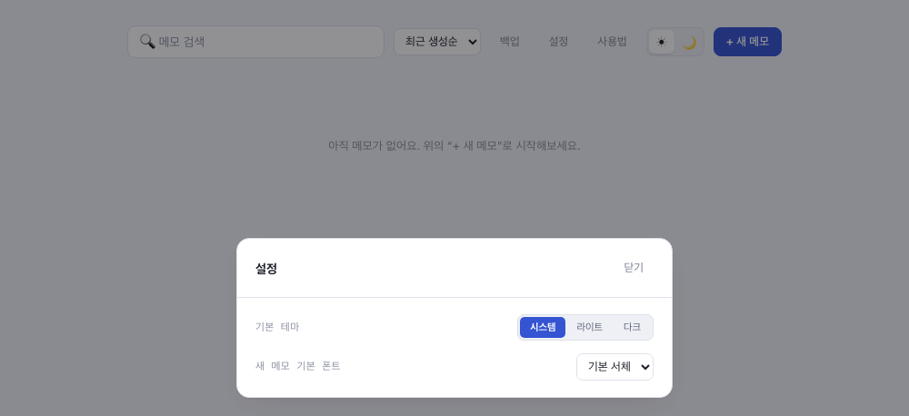 | 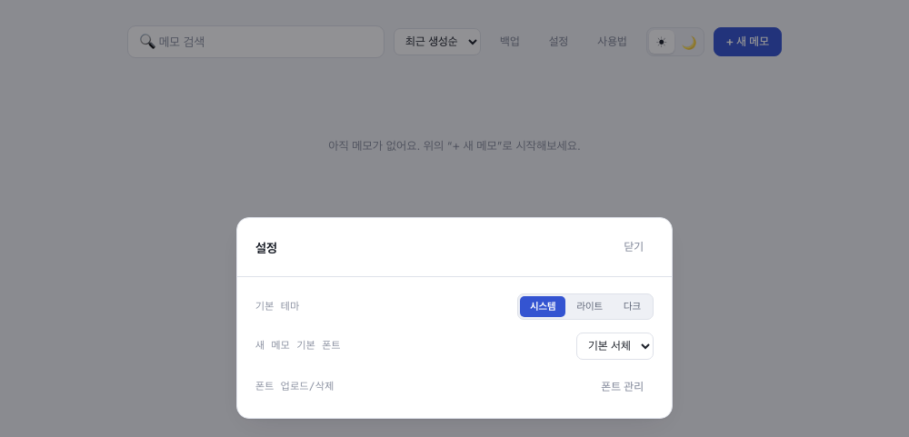 |

메모를 열어야만 폰트를 업로드·삭제할 수 있던 것 → 설정 팝업에 "폰트 관리" 버튼 추가로 메모 없이도 관리 가능.

## 2026-07-31

### 버그 수정

**백업 파일에 설정값이 빠져있음**

기본 테마·기본 폰트 설정이 노트/폰트만 저장되는 백업에는 포함되지 않았음 → 백업에 설정값 포함, 가져오기 시 즉시 적용되도록 수정.

### 추가

- 백업 시 "선택한 메모만 내보내기" 옵션 — 켜면 메모는 선택한 것만, 폰트는 항상 전체 라이브러리를 내보냄

## 2026-07-30

### 버그 수정

**여러 줄 선택 시 하이라이트가 줄바꿈을 깨뜨림**

| AS-IS | TO-BE |
|---|---|
| 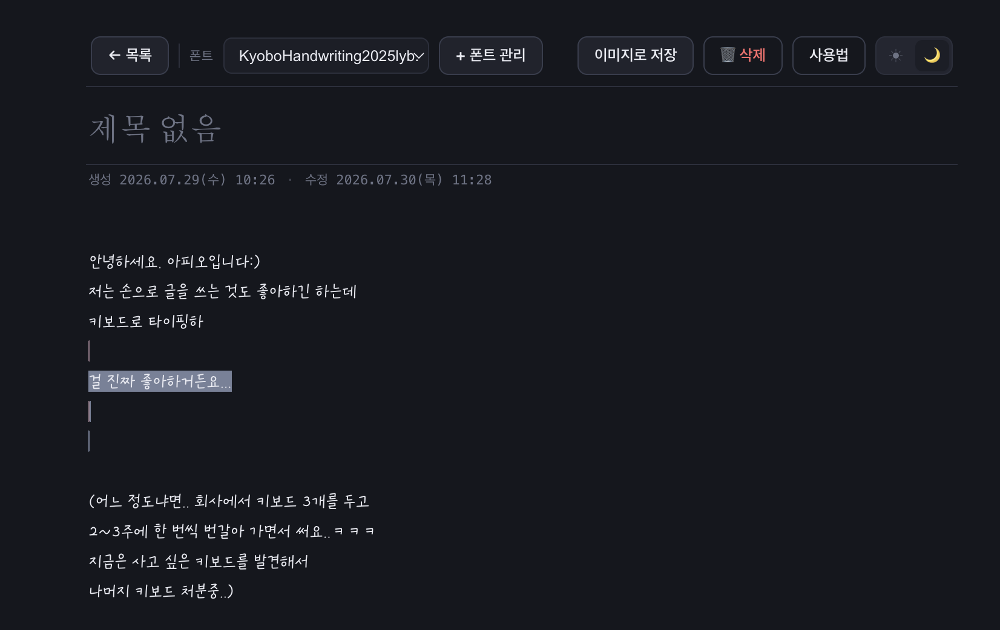 | 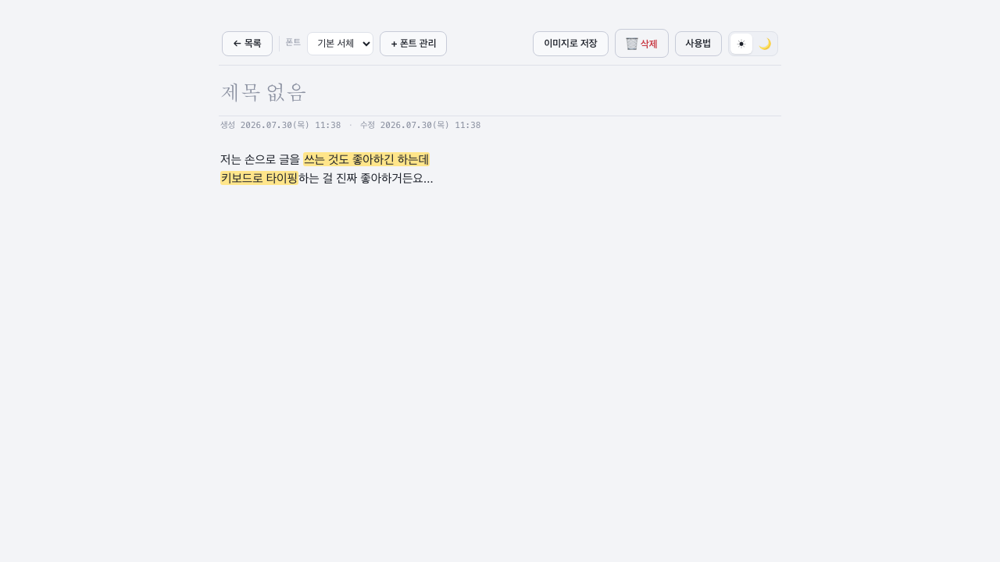 |

선택 영역 전체를 `` 하나로 감싸던 방식 → 텍스트 노드 단위로 개별 래핑.

**이미 스타일 있는 글자에 다른 스타일 적용 시 겹쳐 보임**

| AS-IS | TO-BE |
|---|---|
| 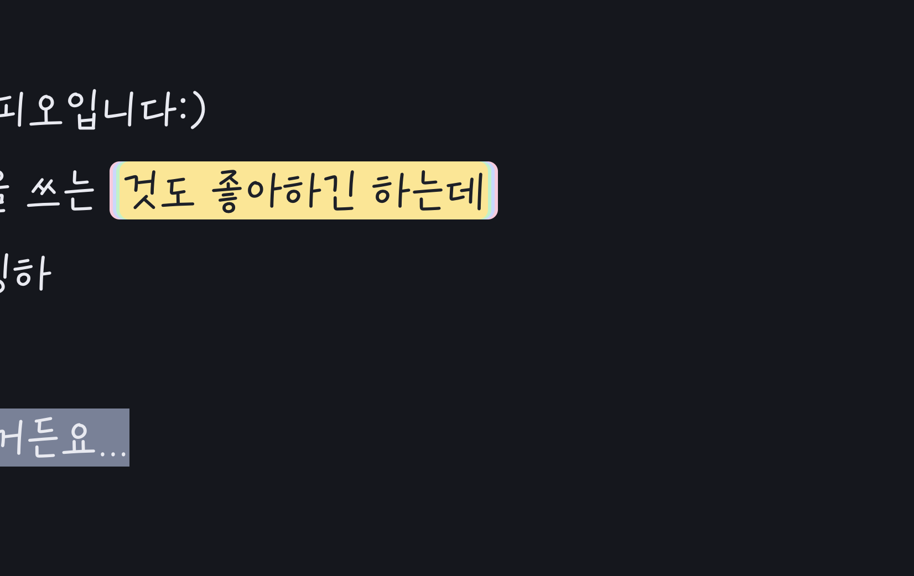 | 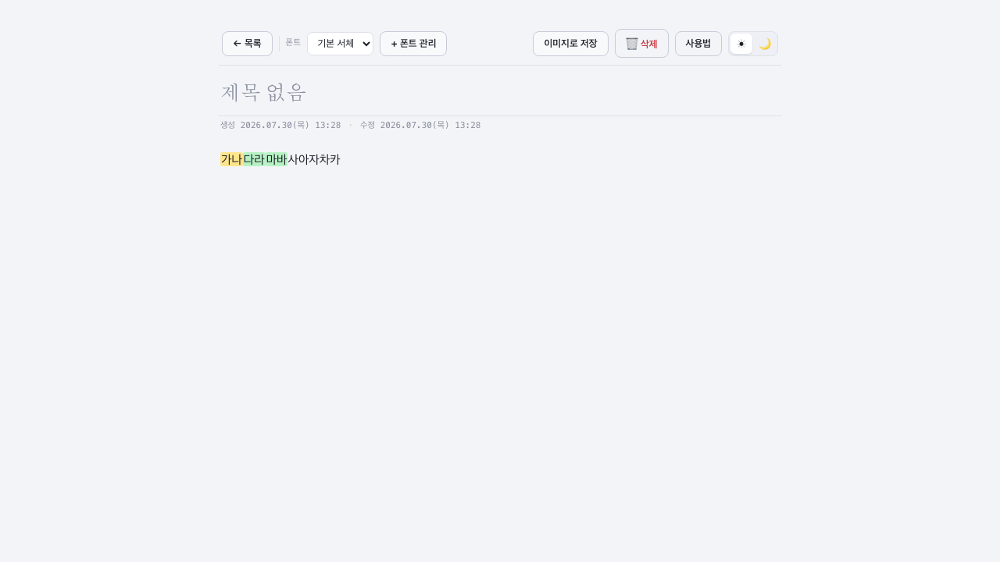 |

새 span이 기존 span 안에 중첩 → 같은 종류 스타일은 교체, 다른 종류는 보존.

**백업/업로드 시 폰트 중복 등록**

| AS-IS | TO-BE |
|---|---|
| 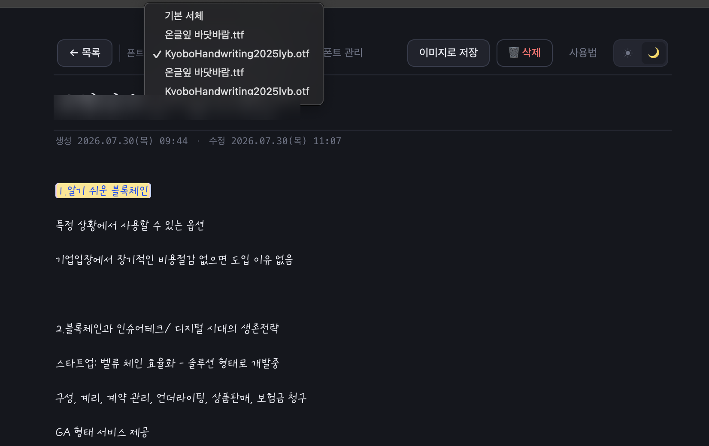 | 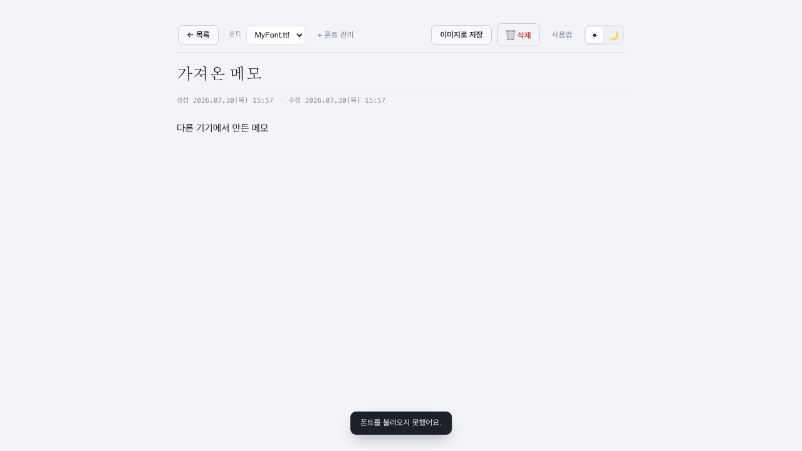 |

id 기준 비교 → 이름 기준으로 동일 폰트 판단, 참조하는 메모의 id도 자동 매핑.

**폰트 목록 삭제 버튼 위치가 행마다 흔들림**

| AS-IS | TO-BE |
|---|---|
| 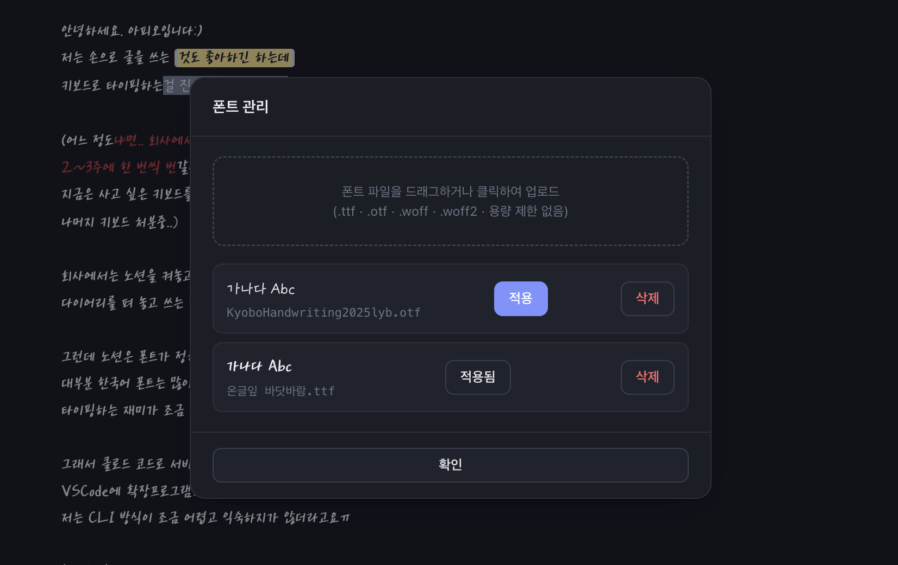 | 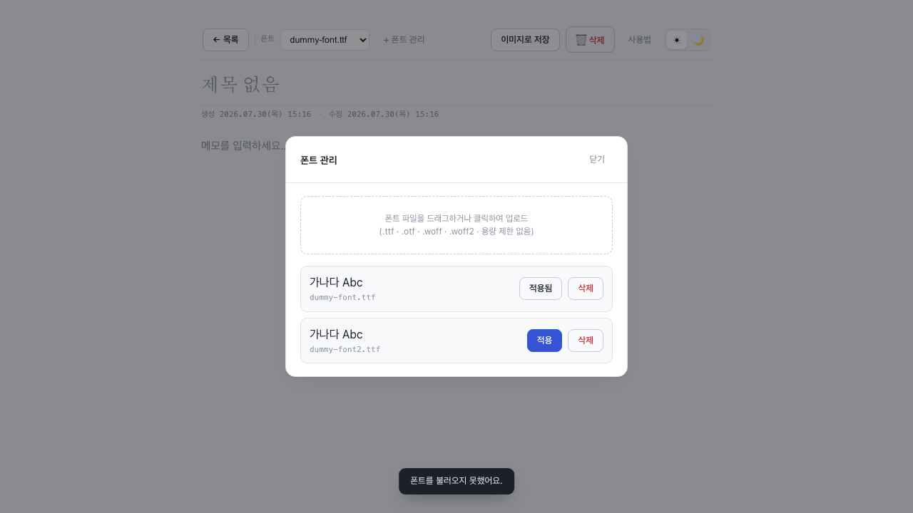 |

적용/삭제 버튼을 한 그룹으로 묶어 고정.

**이미지로 저장 시 둥근 모서리 바깥이 흰색으로 채워짐**

| AS-IS | TO-BE |
|---|---|
|  | 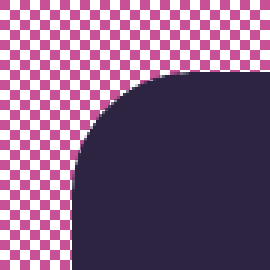 |

html2canvas가 카드의 border-radius를 못 잘라내 모서리 바깥이 불투명 흰색이 됨 → 캡처 대상을 여백 있는 투명 래퍼로 바꾸고 배경을 항상 투명으로 캡처하도록 수정. 카드 바깥에 여백도 추가됨.

### 추가

- 설정 모달(기본 테마, 새 메모 기본 폰트)
- 되돌리기/다시 실행(`Ctrl+Z` / `Ctrl+Shift+Z`)
- 폰트 개별 삭제, 적용된 폰트 버튼 비활성화
- 글자색·하이라이트 "색상 없음" 옵션
- 레이어 팝업 닫기: 모바일은 하단 풀와이드 버튼, PC는 헤더 닫기 버튼

### 변경

- 버튼 위계 4단계(Primary/Secondary/Utility/Danger)로 정리
