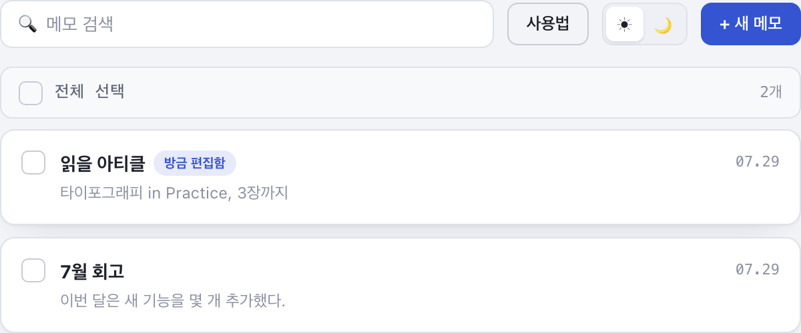

# 메모장

폰트를 직접 업로드해 적용하고, 선택한 글자에만 색상·형광펜·자간·행간을 지정하며, 원하는 영역을 이미지로 내보낼 수 있는 커스텀 웹 메모장입니다. 빌드 과정 없이 브라우저에서 바로 열어 쓸 수 있고, 모든 데이터는 브라우저(IndexedDB)에만 저장됩니다.

> 이 프로젝트는 [Claude Code](https://claude.com/claude-code)로 만들었습니다.

**🔗 라이브 사이트: https://ptina.github.io/memo-app/**



## 주요 기능

- **메모 관리** — 새 메모 생성, 제목·본문 검색, 체크박스로 여러 메모 선택 후 일괄 삭제
- **폰트 커스터마이징** — `.ttf` / `.otf` / `.woff` / `.woff2` 폰트 파일을 업로드해 등록하고, 메모마다 서로 다른 폰트를 지정. 등록한 폰트는 개별 삭제 가능
- **선택 텍스트 스타일링** — 글자를 드래그하면 뜨는 플로팅 툴바로 글자색, 형광펜(4색), 자간, 행간을 선택 영역에만 적용. 색상 없음으로 되돌리기도 가능
- **되돌리기 / 다시 실행** — 편집 중 `Ctrl+Z` / `Ctrl+Shift+Z`로 텍스트 입력과 스타일 변경을 단계별로 되돌리고 다시 실행
- **링크 삽입** — 툴바 버튼으로 선택한 글자에 링크를 걸거나, 본문에 URL을 입력·붙여넣으면 자동으로 링크화. 클릭 시 새 탭에서 열림
- **이미지로 저장** — 선택한 글자 또는 메모 전체(제목 포함 여부 선택 가능)를 배경색·모서리 반경·여백을 골라 PNG로 다운로드
- **설정** — 기본 테마(시스템/라이트/다크)와 새 메모에 자동 적용할 기본 폰트를 지정
- **다크/라이트 모드** — 설정에서 기본값을 정하며, 상단 아이콘으로 언제든 수동 전환 가능
- **생성일·수정일 표시** — 요일과 시간까지 포함해 메모 상단에 표시
- **Tab 들여쓰기 / 화살표 자동 변환** — Tab 입력 시 공백 4칸 들여쓰기, `->`·`=>` 입력 시 `→`·`⇒`로 자동 변환
- **사용법 모달** — 상단 "사용법" 버튼으로 실제 화면 스크린샷과 함께 기능을 언제든 확인 가능

## 기술 스택

- 순수 HTML / CSS / JavaScript (jQuery 3.7.1, CDN)
- [html2canvas](https://html2canvas.hertzen.com/) — 이미지 내보내기
- **IndexedDB** — 메모·폰트 파일 저장 (서버·백엔드 없음, 별도 빌드 도구 없음)

## 시작하기

빌드 과정이 없는 정적 사이트라 별도 설치 없이 바로 실행할 수 있습니다.

```bash
cd memo-app
python3 -m http.server 8080
# 브라우저에서 http://localhost:8080 접속
```

`index.html`을 더블클릭해서 직접 열어도 대부분 동작하지만, 브라우저 환경에 따른 차이를 피하려면 위처럼 로컬 서버로 여는 걸 권장합니다.

## 프로젝트 구조

```
memo-app/
├── index.html          # 전체 화면(목록·편집·모달) 마크업
├── css/style.css        # 스타일 (라이트/다크 테마 포함)
├── js/
│   ├── app.js           # 전체 UI 로직
│   └── db.js            # IndexedDB 데이터 레이어 (notes, fonts)
└── img/help/             # 사용법 모달에 쓰이는 스크린샷
```

## 데이터 저장

메모 본문, 스타일 정보, 업로드한 폰트 파일은 모두 브라우저의 IndexedDB(`memoAppDB`)에 저장됩니다. 서버 동기화는 지원하지 않으며, 브라우저 저장소를 지우면 데이터도 함께 삭제됩니다.
